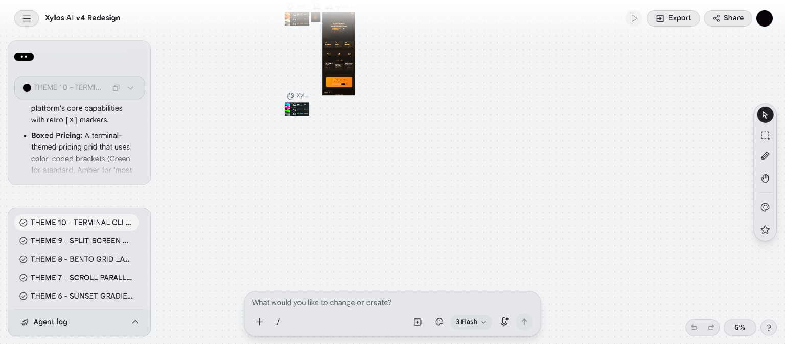
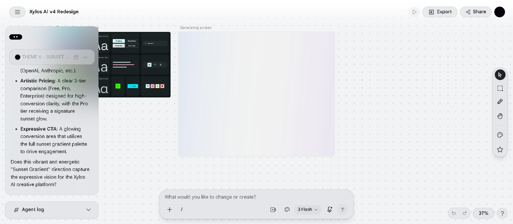
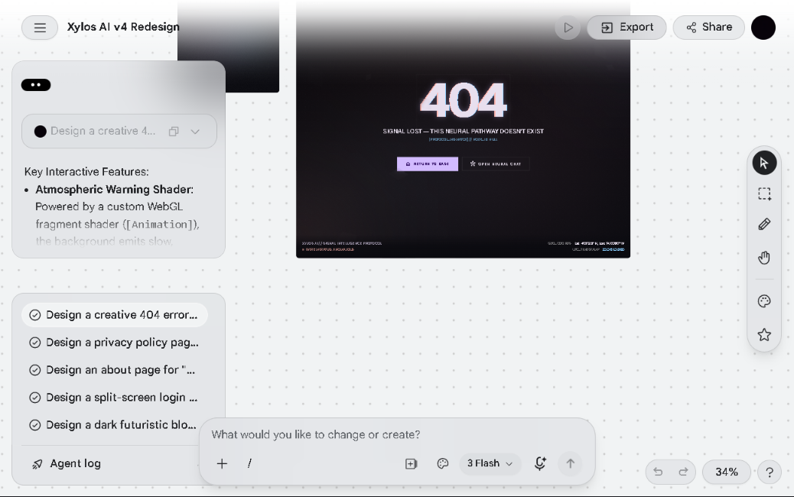
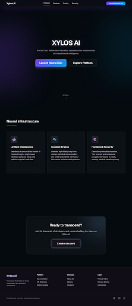
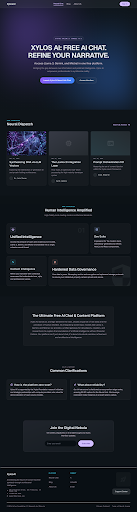
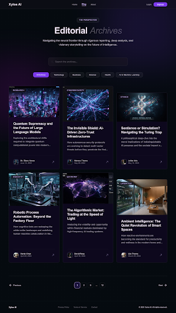
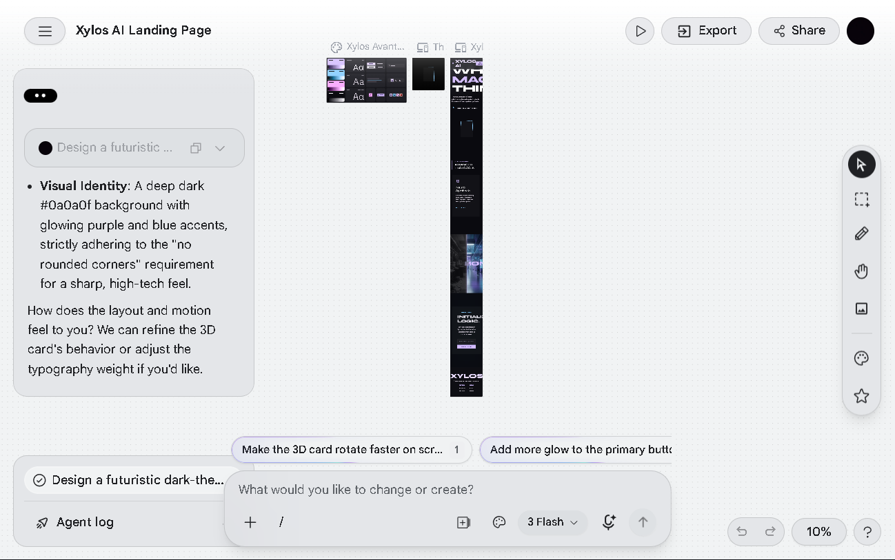
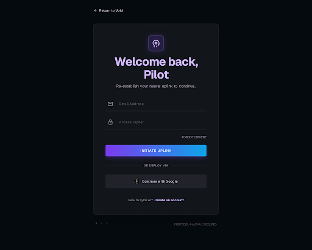

# Xylos AI — Stitch Theme Gallery

All 10 themes generated on Stitch (Google AI Design Tool) for the Xylos AI v4 Redesign project.

**Stitch Project:** "Xylos AI v4 Redesign" (ID: `9288647438722416872`)
**Stitch URL:** https://stitch.withgoogle.com

---

## Theme Overview

| # | Theme Name | Structure | Key Feature |
|---|-----------|-----------|-------------|
| 1 | Clean Light | Standard centered | Minimal, light-friendly palette |
| 2 | Warm Amber | Standard centered | Warm tones, cozy feel |
| 3 | Neon Cyberpunk | Standard centered | Neon glow, dark futuristic |
| 4 | Ocean Blue | Standard centered | Deep blue gradients |
| 5 | Emerald Nature | Standard centered | Green/earth tones |
| 6 | Sunset Gradient | Standard centered | Orange/pink gradients |
| 7 | Scroll Parallax | Full-screen sections | Apple-style scroll snap, parallax |
| 8 | Bento Grid | Asymmetric box grid | **CHOSEN** — Asymmetric bento cards |
| 9 | Split-Screen Narrative | Left/right editorial | Magazine-style split layout |
| 10 | Terminal CLI | Hacker terminal | Monospace, command-line aesthetic |

---

## Combined Screenshots

### All 10 Themes Overview

### 6 Themes Comparison

### All Designs Collection

---

## Individual Theme Screenshots

### Theme 1 — Clean Light

### Theme 2 — Warm Amber

### Theme 7 — Scroll Parallax

### Theme 8 — Bento Grid (Current)

### Theme 9 — Split-Screen Narrative

### Theme 10 — Terminal CLI

---

## Stitch Design Pages

| Page | Screenshot |
|------|-----------|
| Landing Hero | `stitch-designs/01-landing-hero.png` |
| Blog Archive | `stitch-designs/02-blog-archive.png` |
| Blog Post | `stitch-designs/03-blog-post.png` |
| Login | `stitch-designs/04-login.png` |
| Chat | `stitch-designs/05-chat.png` |
| Dashboard | `stitch-designs/06-dashboard.png` |
| Create Post | `stitch-designs/07-create-post.png` |
| Posts Management | `stitch-designs/08-posts-mgmt.png` |
| AI Manager | `stitch-designs/09-ai-manager.png` |
| Settings | `stitch-designs/10-settings.png` |
| 404 Page | `stitch-designs/11-404.png` |
| Privacy | `stitch-designs/12-privacy.png` |

---

## V2 Design Pages

| Page | Screenshot |
|------|-----------|
| Landing | `stitch-designs/v2-01-landing.png` |
| Blog Archive | `stitch-designs/v2-02-blog-archive.png` |
| Blog Post | `stitch-designs/v2-03-blog-post.png` |
| About | `stitch-designs/v2-04-about.png` |
| Login | `stitch-designs/v2-05-login.png` |
| Chat | `stitch-designs/v2-06-chat.png` |
| Dashboard | `stitch-designs/v2-07-dashboard.png` |
| Create Post | `stitch-designs/v2-08-create-post.png` |
| Posts Management | `stitch-designs/v2-09-posts-mgmt.png` |
| AI Manager | `stitch-designs/v2-10-ai-manager.png` |
| Settings | `stitch-designs/v2-11-settings.png` |
| 404 Page | `stitch-designs/v2-12-404.png` |
| Privacy | `stitch-designs/v2-13-privacy.png` |

---

## Current Implementation

**Chosen Theme:** Bento Grid (Theme 8)
**Color Palette:**
- Background: `#0f0f14`
- Primary: Violet `#8b5cf6`
- Secondary: Cyan `#06b6d4`
- Tertiary: Pink `#f472b6`
- Border Radius: 12px (rounded-2xl / rounded-3xl)

**Status:** Implemented on all public pages (landing, login, blog, about, 404, privacy, tools).
Dashboard pages remain unchanged.

---

*Generated: July 26, 2026*
