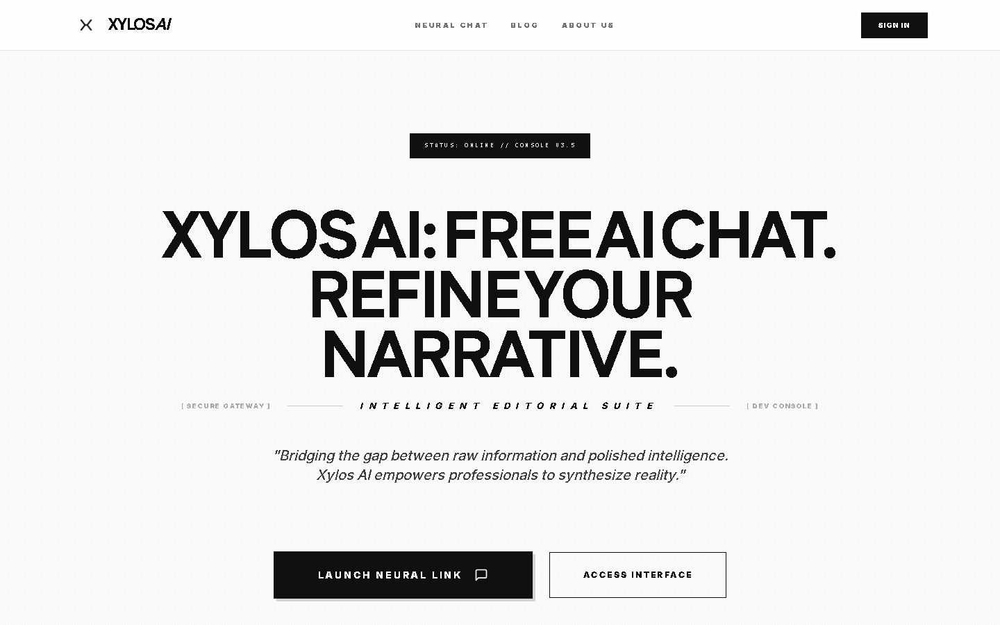
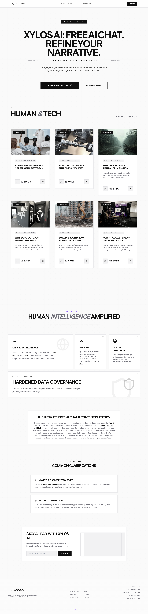
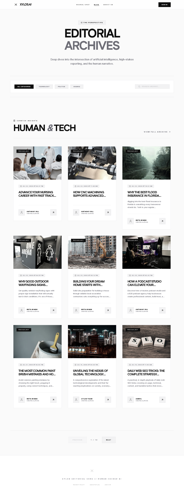
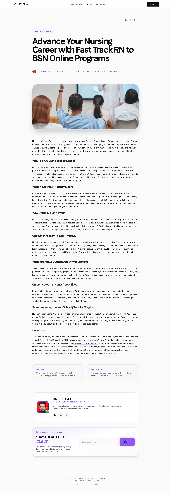
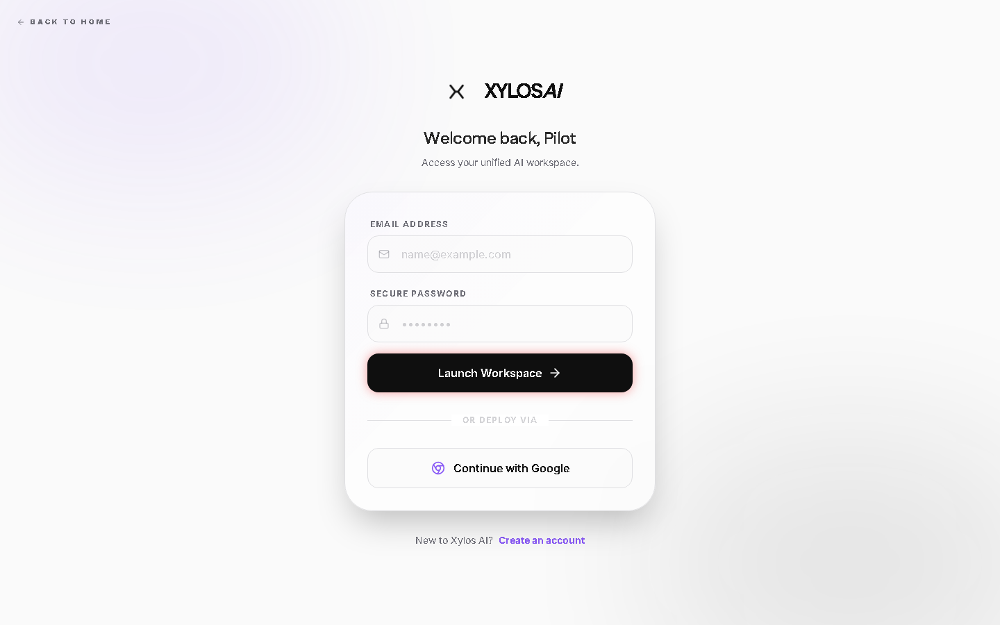
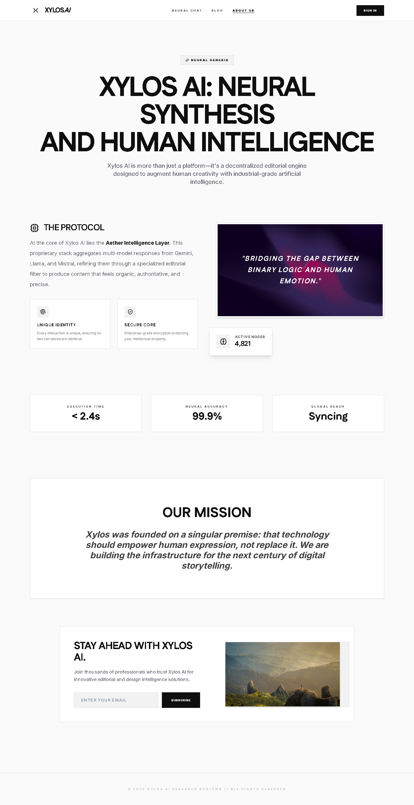
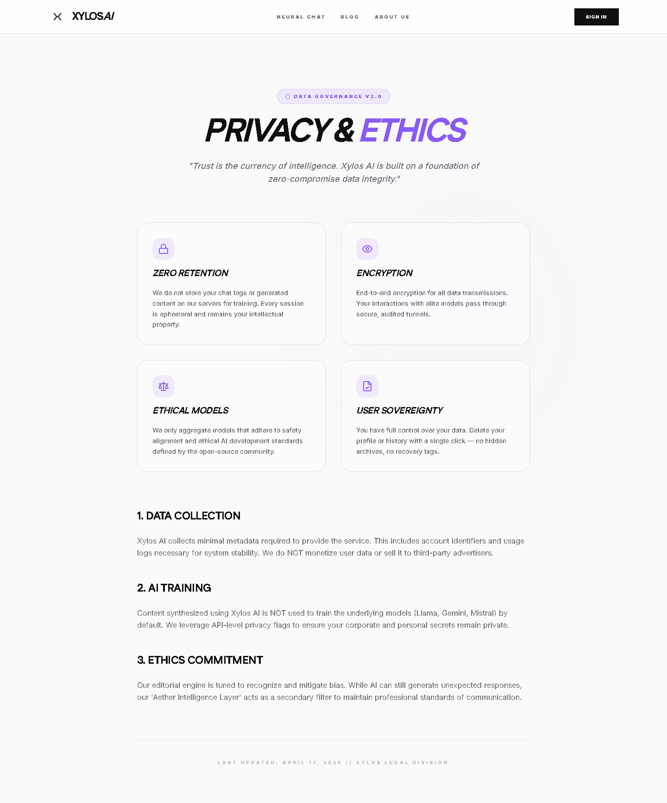

# Xylos AI — Design System

<p align="center">
  
</p>

## Brand Identity

Xylos AI is a free AI platform featuring Llama 3, Gemini, and Mistral. The visual identity is **brutalist minimalism** — sharp architectural shapes (zero border-radius), high-contrast monochrome with accent dynamism, and editorial-grade typography.

- **Radius**: `0px` everywhere — crisp, unapologetic right angles
- **Borders**: Ultra-subtle hairline (`240 5.9% 88%`) on every card and section
- **Primary**: Pure black (`0 0% 0%`) — dynamically overridable by the user via `PrimaryColorProvider`
- **Glow system**: Neon red/violet via `primary.glow` / `secondary.glow`
- **Mood**: Editorial, futuristic, premium, high-contrast

---

## Color System

All colors are CSS custom properties defined in `app/globals.css` and mapped to Tailwind in `tailwind.config.ts`.

### Core Tokens

| Token | Light Value | Usage |
|---|---|---|
| `--background` | `0 0% 98%` | Page background (porcelain white) |
| `--foreground` | `0 0% 6%` | body text (deep charcoal) |
| `--primary` | `0 0% 0%` | Brand accent, buttons, links |
| `--primary-foreground` | `0 0% 100%` | Text on primary surfaces |
| `--card` | `0 0% 100%` | Card/panel surfaces |
| `--card-foreground` | `0 0% 6%` | Text on cards |
| `--muted` | `240 4.8% 95%` | Subtle backgrounds |
| `--muted-foreground` | `240 4% 45%` | Secondary/subtle text |
| `--secondary` | `240 5.9% 15%` | Graphite slate accent |
| `--border` | `240 5.9% 88%` | Hairline borders |
| `--radius` | `0px` | No border-radius |
| `--ring` | `0 0% 0%` | Focus ring |

### Extended Colors (Tailwind only)

| Name | Value | Usage |
|---|---|---|
| `primary.glow` | `rgba(239, 68, 68, 0.5)` | Red neon glow |
| `secondary.glow` | `rgba(157, 0, 255, 0.5)` | Violet neon glow |
| `accent.gold` | `#FFD700` | Gold accents |
| `navy.900` | `#020617` | Deep navy backgrounds |
| `navy.950` | `#000000` | Near-black |

### Dynamic Primary Color

The `PrimaryColorProvider` (`components/primary-color-provider.tsx`) allows users to customize the primary color. It reads a hex from `localStorage` (`xylos-primary-color`), converts it to HSL via `lib/utils/color.ts`, and injects it into `--primary` / `--ring` on `<html>`. Default: `#8b5cf6` (violet).

---

## Typography

### Fonts

| Font | Variable | Weight | Usage |
|---|---|---|---|
| **Inter** | `--font-inter` | 400–900 variable | Body text, UI labels |
| **Fustat** | `--font-fustat` | 400–900 variable | Headings, uppercase display |

### Patterns

- **Headings**: `font-fustat font-black tracking-tighter uppercase`
- **Body**: `font-inter font-medium` (light weight for body, heavier for emphasis)
- **Meta text**: `text-[9px] md:text-[10px] font-bold uppercase tracking-widest`
- **Uppercase labels**: `font-black text-[10px] uppercase tracking-[0.3em]`

---

## Component Architecture

### Directory Layout

```
components/
  landing/          # Landing page sections (navbar, hero, blog-grid, newsletter-form)
  blog/             # Blog components (author-bio, newsletter-card, share-buttons)
  premium/          # Animated/effects components (logo, tilt, splash, mouse-glow)
  ui/               # Reusable primitives (toast, modal, select, text animations)
  editor/           # TipTap editor and media tools
  global-navbar.tsx # Root layout navbar (client-side, hides on app pages)
  auth-listener.tsx # Cross-tab auth sync
  error-boundary.tsx# Editorial error boundary
```

### Key Patterns

- **"use client"** on any component with `useState`, `useEffect`, or interactivity
- **Server components** default for pages — data fetching done in the page/component, not in layout
- **Dynamic imports** for heavy components (splash-loader, scroll-to-top, navbar)
- **Suspense** boundaries around async children (blog-filters, login page)

---

## Page Templates

### Landing Page (`app/page.tsx`)

<p align="center">
  
</p>

- ISR: `revalidate = 1800` (30 min)
- Sections: Navbar → Hero → Feature Grid → Blog Grid → Footer
- The `blog-grid` fetches 3 published posts

### Blog Archive (`app/blog/page.tsx`)

<p align="center">
  
</p>

- ISR: `revalidate = 600` (10 min)
- Paginated (9 per page), category filtering, search
- Uses `@supabase/supabase-js` directly (public client with service role)
- Manual profile enrichment (decoupled from blog query to avoid FK failures)

### Blog Post (`app/blog/[slug]/page.tsx`)

<p align="center">
  
</p>

- SSR (no ISR — content must be fresh)
- JSON-LD structured data for SEO (BlogPosting + BreadcrumbList)
- Content rendering via `react-markdown` with `remark-gfm`
- HTML content allowed via `dangerouslySetInnerHTML` with `sanitizeHtml()` stripping scripts/iframes
- Components: `AnimeText` (title animation), `AuthorBio`, `NewsletterCard`, `ShareButtons`

### Login (`app/login/page.tsx`)

<p align="center">
  
</p>

- Client component with email/password and Google OAuth
- Toggle between Login/Signup modes
- Uses Supabase server actions (`signInWithEmail`, `signUpWithEmail`, `signInWithGoogle`)

### About (`app/about/page.tsx`)

<p align="center">
  
</p>

- Server component with metadata and client content section
- Sections: Navbar → Hero → Mission → FAQ → Newsletter → Footer

### Privacy (`app/privacy/page.tsx`)

<p align="center">
  
</p>

### Chat (`app/chat/page.tsx`)
- `force-dynamic` — no caching
- Multi-model AI chat with 7 providers, tiered fallback
- Routes: `/chat` (default), `/chat/[id]` (existing conversation)
- Middleware redirects unauthenticated users to `/`

### Dashboard (`app/dashboard/`)
- Protected routes (middleware + client-side check)
- Layout: sidebar navigation + header + content area
- Sub-routes: `/create` (editor), `/posts` (management), `/ai-manager` (admin)

---

## Animation & Effects

| Component | Library | Effect |
|---|---|---|
| `AnimeText` | animejs | Word-by-word text reveal |
| `TiltCard` | framer-motion | 3D hover tilt on blog cards |
| `MouseGlow` | framer-motion | Cursor-following radial glow |
| `SplashLoader` | framer-motion | Fullscreen initial load animation |
| `ScrollToTop` | framer-motion | Floating scroll-to-top button |
| `TextRollNavigation` | framer-motion | Rolling text on hover |
| `ProgressBar` | nextjs-toploader | Top loading bar on route change |
| `RevealText` | framer-motion | Scroll-triggered text reveal |
| Custom CSS | `@keyframes` | `loading-bar`, `bounce-slow`, `float` |

All framer-motion components use `LazyMotion` with `domAnimation` for tree-shaking (root layout wraps children).

---

## Responsive Breakpoints

| Prefix | Min Width | Usage |
|---|---|---|
| `(none)` | 0 | Mobile-first base styles |
| `md:` | 768px | Tablet / desktop layout switch |
| `lg:` | 1024px | Wider grids (3-col blog) |
| `xl:` | 1280px | Side accents, large spacing |

Mobile menu: hamburger toggle with `hidden md:flex` for nav links + full-screen overlay.

---

## CSS Custom Classes

Defined in `app/globals.css` under `@layer components`:

- `.glass-navbar` — Glass morphism navbar (`backdrop-blur-[50px] bg-card/30`)
- `.glass-cta` — Glass-style CTA button with hover scale
- `.hero-glow` — Radial red glow for hero sections
- `.chat-container` — `max-width: 48rem` centered container
- `.cyber-grid-pattern` — Subtle dot-grid background
- `.cyber-header-glow` — Gradient text fill for headers

---

## Spacing & Layout

- **Page padding**: `px-6` horizontal, `pt-32 md:pt-40` top offset (fixed navbar height)
- **Max content width**: `max-w-7xl` (1280px) for main sections
- **Card padding**: `p-8 md:p-10` inside blog cards
- **Section gaps**: `space-y-12 md:space-y-20` between major sections
- **Grid**: `grid grid-cols-1 md:grid-cols-2 lg:grid-cols-3 gap-12`
- **Zero border-radius** everywhere — `rounded-none` is default for cards, buttons, inputs
- Exception: `rounded-[2.5rem]` used sparingly for premium callout blocks

---

## Middleware & Auth Flow

The `middleware.ts` + `utils/supabase/middleware.ts` handles:

1. **Public bypass**: `/`, `/blog`, `/about`, `/privacy`, `/blog/*` — skip Supabase session refresh for edge caching
2. **SEO bypass**: `/sitemap.xml`, `/robots.txt` — direct pass-through
3. **Logged-in redirect**: `/login` → `/dashboard` if session exists
4. **Logged-out guard**: All routes except `/login`, `/auth`, `/api`, `/blog`, `/about`, `/privacy`, `/` → redirect to `/`
5. **Protected dashboard routes** require auth; middleware redirects to `/` if unauth'd

---

## Testing

Playwright E2E tests in `tests/` (10 spec files, 52 tests):

| File | Scope |
|---|---|
| `01-landing.spec.ts` | Title, nav links, blog grid, navigation, newsletter, broken images |
| `02-blog.spec.ts` | Listing, post navigation, content, images, author bio, share, newsletter |
| `03-auth.spec.ts` | Login page load, fields, Google OAuth, sign-up toggle |
| `04-about.spec.ts` | Page load, content visibility |
| `05-chat.spec.ts` | Auth redirect, CTA visibility, nav link |
| `06-pages.spec.ts` | Privacy, sitemap, robots.txt, 404 |
| `07-api.spec.ts` | Auth guards on automate, subscribe, upload, chat, blog/generate, sitemap |
| `08-navigation.spec.ts` | Cross-page nav, console errors, blog-to-home, archive nav, logo |
| `09-performance.spec.ts` | Page load times (<8s), 4xx/5xx response check |
| `10-dashboard.spec.ts` | Auth redirect on all dashboard routes |

All tests use `baseURL: "https://xylosai.vercel.app"` targeting the live production site.

---

## Environment Variables

| Variable | Purpose |
|---|---|
| `NEXT_PUBLIC_SITE_URL` | Canonical site URL |
| `NEXT_PUBLIC_SUPABASE_URL` | Supabase project URL |
| `NEXT_PUBLIC_SUPABASE_ANON_KEY` | Supabase anon key (client-side safe) |
| `SUPABASE_SERVICE_ROLE_KEY` | Service role for admin operations (server-only) |
| `RESEND_API_KEY` | Email service API key |
| `PEXELS_API_KEY` | Stock photo search API key |
| `CLOUDFLARE_API_TOKEN` | Cloudflare Workers AI token |
| `CLOUDFLARE_ACCOUNT_ID` | Cloudflare account ID |
| `GROQ_API_KEY` | Groq AI API key |
| `OPENROUTER_API_KEY` | OpenRouter API key |
| `GOOGLE_GEMINI_API_KEY` | Google Gemini API key |
| `MISTRAL_API_KEY` | Mistral AI API key |
| `FIREWORKS_API_KEY` | Fireworks AI API key |
| `CEREBRAS_API_KEY` | Cerebras API key |
| `HUGGINGFACE_API_KEY` | Hugging Face API key |
| `NEXT_PUBLIC_GA_ID` | Google Analytics measurement ID |
| `NEXT_PUBLIC_GTM_ID` | Google Tag Manager container ID |
