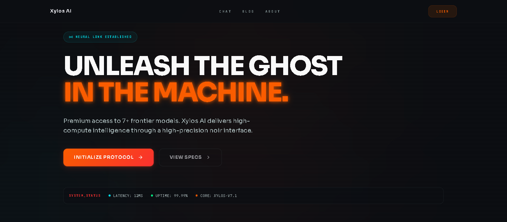
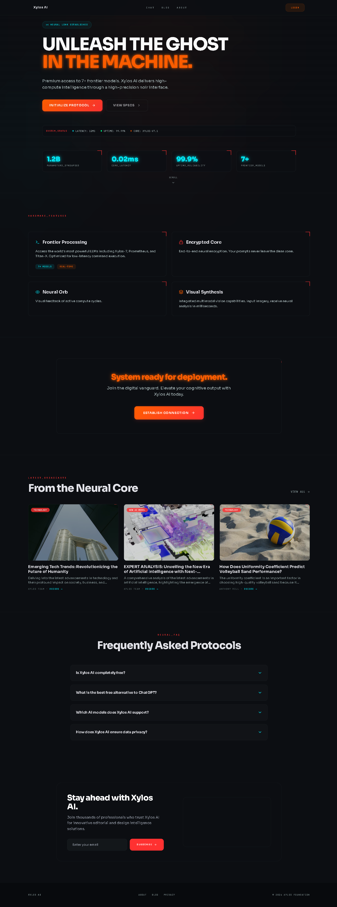
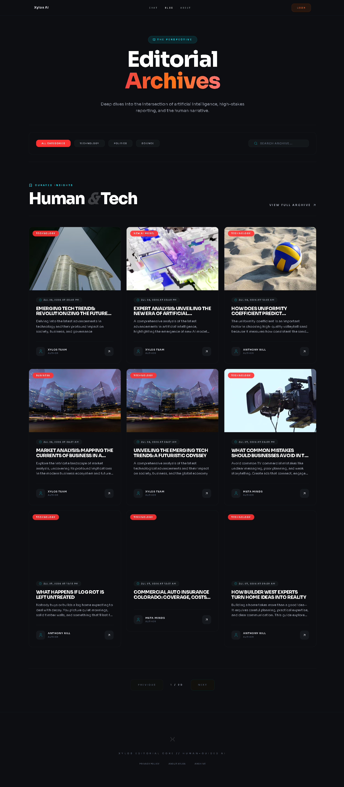
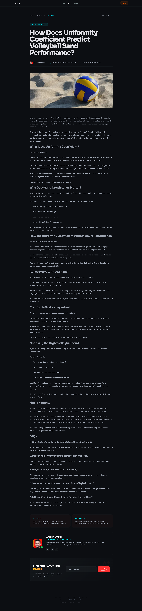
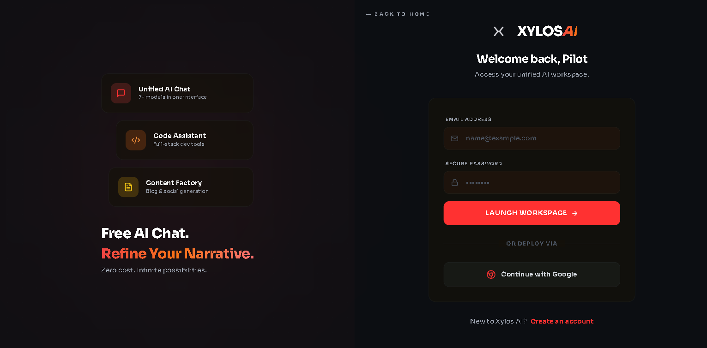
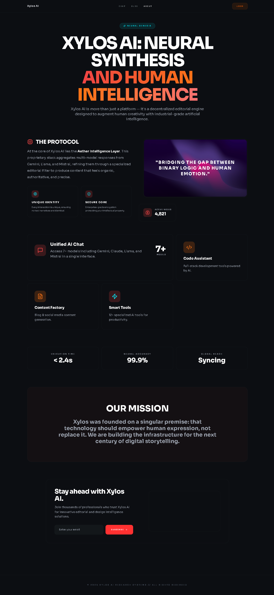
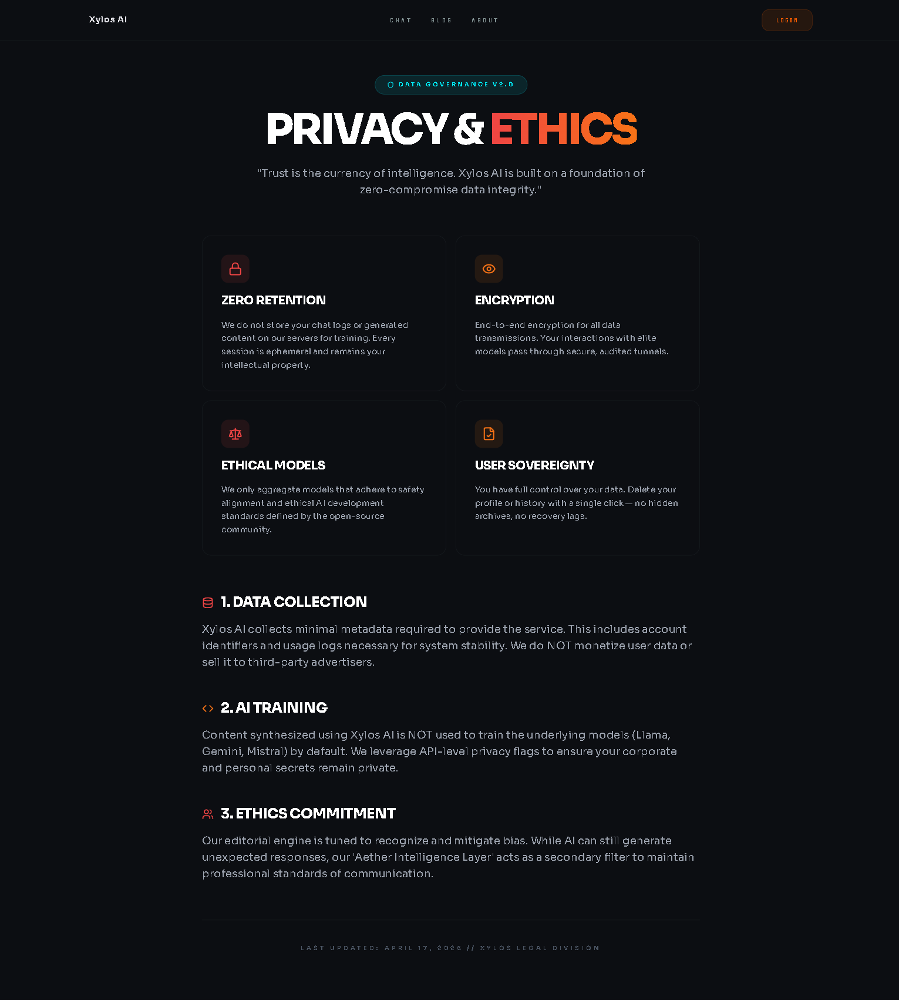

<p align="center">
  
</p>

<p align="center">
  <strong>Free AI Chat &amp; Blog Platform</strong><br/>
  Llama 3 · Gemini · Mistral — Zero cost, professional grade.
</p>

<p align="center">
  <a href="https://xylosai.vercel.app"></a>
  <a href="#-tech-stack"></a>
  <a href="#-tech-stack"></a>
  <a href="https://github.com/surinder2003k/Xylos-AI/actions/workflows/ci.yml"></a>
  <a href="https://github.com/surinder2003k/Xylos-AI"></a>
</p>

---

## Overview

**Xylos AI** is a high-performance generative editorial intelligence platform. It brings 7+ AI models together under one premium workspace — completely free. Built for creators, analysts, and developers who need professional-grade AI tools without the paywall.

| Feature | Detail |
|---|---|
| AI Models | Llama 3.3 70B, Gemini Pro, Mistral, Cerebras, and more |
| Chat | Multi-model chat with automatic failover routing |
| Blog Engine | AI-powered generation, rich editing, SEO optimization |
| Dashboard | Post management, analytics, AI settings, user management |
| Automation | Cron-based auto-publishing pipeline with category management |
| Auth | Email/password + Google OAuth via Supabase |
| SEO | Structured data, FAQ schema, sitemap, OpenGraph, breadcrumbs |
| 404 Page | Custom Cyberpunk Noir themed error page |

---

## Screenshots

| Landing Page | Blog Archive |
|---|---|
|  |  |

| Blog Post | Login |
|---|---|
|  |  |

| About | Privacy |
|---|---|
|  |  |

---

## Tech Stack

| Category | Technology |
|---|---|
| **Framework** | Next.js 15 (App Router, ISR, React 19) |
| **Database / Auth** | Supabase (Postgres, SSR auth, Storage) |
| **Styling** | Tailwind CSS 3 + `@tailwindcss/typography` |
| **Theme** | Cyberpunk Noir (dark bg, neon accents, glass morphism) |
| **Animations** | Framer Motion 11, Animejs 4 |
| **Editor** | TipTap 3 (ProseMirror) |
| **AI Providers** | Groq, OpenRouter, Google Gemini, Mistral, Fireworks, Cerebras, Hugging Face, Cloudflare |
| **Email** | Resend |
| **Icons** | Lucide React |
| **Fonts** | Sora (headings), JetBrains Mono (labels) |
| **Testing** | Playwright (10 test suites) |
| **Deployment** | Vercel |

---

## Design System — Cyberpunk Noir

| Token | Value |
|---|---|
| Background | `#0c0e12` |
| Primary Red | `#ff3131` |
| Neon Orange | `#ff5e00` |
| Cyan Accent | `#00f0ff` |
| Text | `#e2e2e8` |
| Borders | `rgba(59, 73, 75, 0.2)` |
| Heading Font | Sora |
| Label Font | JetBrains Mono |
| Components | Glass panels, neon glows, scanline overlays, holographic flicker |

---

## Getting Started

### Prerequisites

- Node.js 18+
- Supabase project
- API keys for desired AI providers

### Setup

```bash
git clone https://github.com/surinder2003k/Xylos-AI.git
cd Xylos-AI
npm install
```

### Environment Variables

Create `.env.local`:

```env
NEXT_PUBLIC_SUPABASE_URL=your_supabase_url
NEXT_PUBLIC_SUPABASE_ANON_KEY=your_anon_key
SUPABASE_SERVICE_ROLE_KEY=your_service_role_key
RESEND_API_KEY=your_resend_key
GROQ_API_KEY=your_groq_key
GOOGLE_GEMINI_API_KEY=your_gemini_key
OPENROUTER_API_KEY=your_openrouter_key
MISTRAL_API_KEY=your_mistral_key
CEREBRAS_API_KEY=your_cerebras_key
CLOUDFLARE_ACCOUNT_ID=your_cloudflare_account_id
CLOUDFLARE_API_TOKEN=your_cloudflare_api_token
```

Only the providers you configure show up in the in-app **Model Library** — the
chat model picker fetches each provider's live model list (1h cache) so newly
released free models appear automatically.

### Database

Run the migration files in `database/` via Supabase SQL Editor:

| File | Purpose |
|---|---|
| `cms_v3_migration.sql` | Core tables: blogs, profiles, chats, conversations, messages, app_settings |
| `migrations/add_last_seen.sql` | Adds `profiles.last_seen_at` for the admin Online / Last seen directory |
| `supabase-init.sql` | Storage buckets, triggers, policies |

### Storage

Create a **public** bucket named `blog-images` in Supabase Storage for image uploads.

### Development

```bash
npm run dev
# Open http://localhost:3000
```

### Production Build

```bash
npm run build
npm start
```

---

## Project Structure

```
app/                  Next.js App Router pages and API routes
├── page.tsx          Landing page with blog section, FAQ, newsletter (ISR: 30 min)
├── layout.tsx        Root layout with Cyberpunk Noir theme, fonts, structured data
├── blog/             Blog archive with pagination, filters, search
├── blog/[slug]/      Individual blog posts with author bio, share buttons
├── chat/             Multi-model AI chat
├── dashboard/        Protected dashboard (editor, posts, AI manager, settings)
├── login/            Authentication page (noindex)
├── about/            About page with team stats
├── privacy/          Privacy policy
├── not-found.tsx     Custom 404 page (Cyberpunk Noir)
├── sitemap.ts        Dynamic sitemap with blog posts
├── robots.txt        SEO directives
└── api/              API routes (chat, blog/generate, automate, subscribe, upload)

components/           React components
├── landing/          Navbar, hero, blog-grid, newsletter-form
├── blog/             AuthorBio, NewsletterCard, ShareButtons
├── premium/          Animated logo, splash loader, tilt cards, mouse glow
├── ui/               Toast, modal, select, text animations, global effects
└── editor/           TipTap editor, Pexels library, image upload

lib/                  Server utilities (AI providers, image generation, utils)
database/             SQL migration files
tests/                Playwright E2E tests (10 suites)
```

---

## SEO Features

| Feature | Status |
|---|---|
| OpenGraph + Twitter Cards | ✅ |
| JSON-LD (WebSite, Organization, FAQPage, BlogPosting, BreadcrumbList) | ✅ |
| Dynamic sitemap.xml | ✅ |
| robots.txt | ✅ |
| Canonical URLs | ✅ |
| Meta descriptions | ✅ |
| Noindex on private pages (login, settings, chat) | ✅ |
| PageSpeed Optimized | ✅ |

---

## Testing

10 Playwright suites covering landing, blog, auth, about, chat, static pages, API endpoints, navigation, performance, and dashboard.

```bash
# against the deployed site (default target)
npx playwright test

# against your own production build — what CI does
npm run build
PLAYWRIGHT_TARGET_LOCAL=1 npx playwright test
```

The local target starts and stops the server itself. CI runs the same command on
every push and pull request, so a green badge means the committed code works —
not that production happens to be up.

Database changes are applied by hand in the Supabase SQL editor; see
[`database/README.md`](database/README.md) for which files are safe to run and
which one will delete your data.

---

## License

This project is provided for educational and research purposes. All trademarks and model rights belong to their respective owners.
